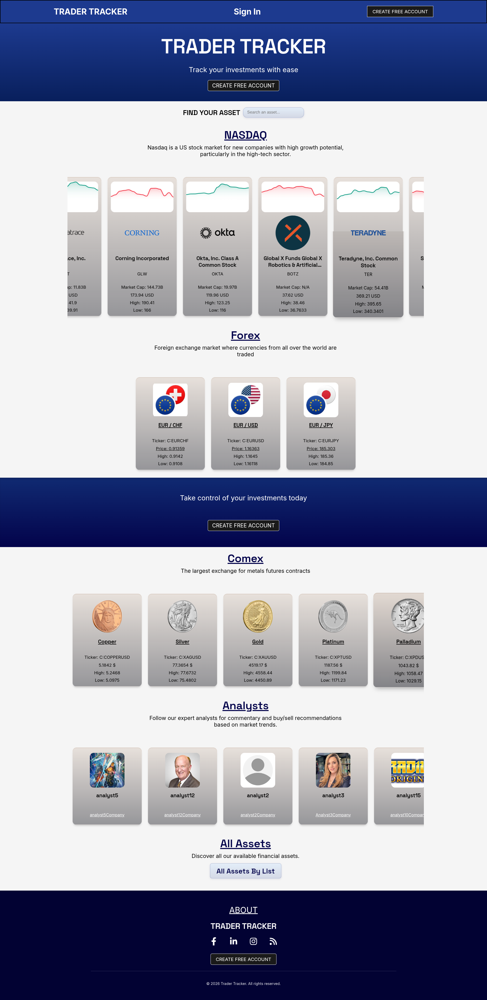
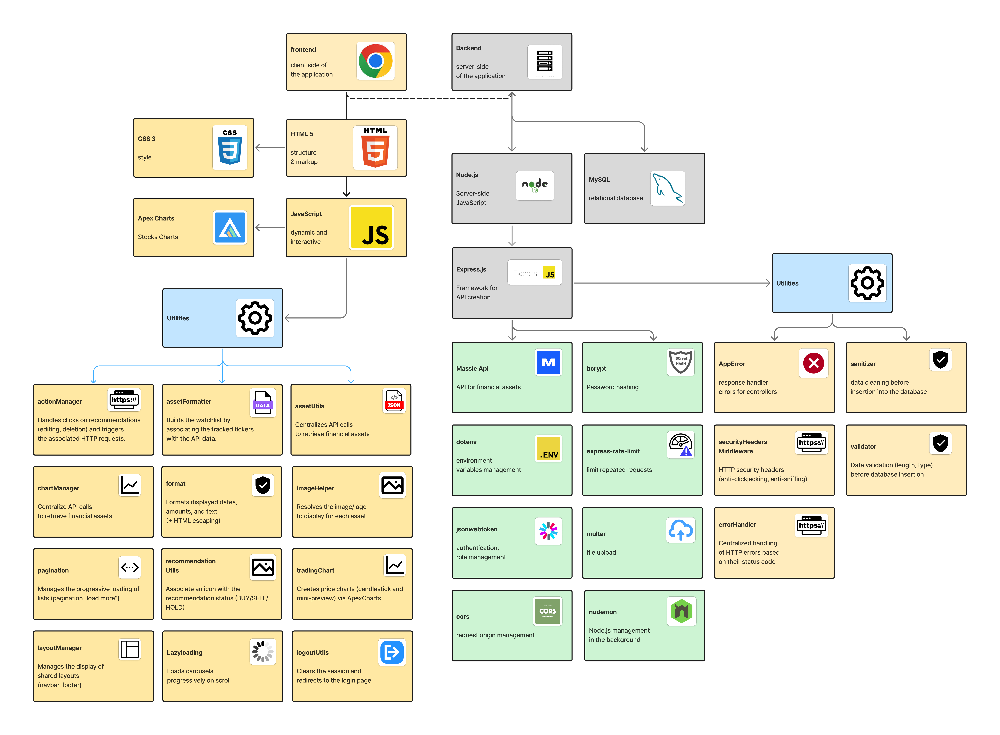

# App Overview

Trader Tracker is a web platform that allows individual investors to track financial assets (stocks, currencies, commodities) 
and view recommendations published by specialized analysts.

## Technologies Used

## Front-end
- **HTML 5**
- **CSS 3**
- **ApexCharts**

## Back-end
- **node.js**
- **express.js**
- **jsonwebtoken**
- **bcrypt**
- **massive API**
- **cors**
- **express-rate-limit**
- **multer**
- **nodemon**
- **dotenv**

# Project architecture

The application follows the MVC pattern by separating:
- **models:** business logic and interactions with the MySQL database
- **views:** HTML pages
- **controllers:** handling of user requests
- **router:** management of actions via URLs

# App screenshots

# Technical stack and application modules

# Licence
This project is under a proprietary license.
  
